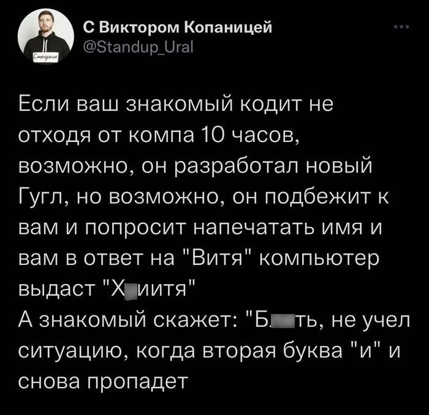

# This meme implemented



## Running

Requires [node.js](https://nodejs.org/en) to run.

```sh
npm run start
```

or 


```sh
node src/index.js
```

## Examples

```sh
$ node ./src/index.js
Как вас зовут?
Витя
Хуитя
$ node ./src/index.js
Как вас зовут?
Оля
Хуёля
$ node ./src/index.js
Как вас зовут?
Слава
Хуява
$ node ./src/index.js
Как вас зовут?
Петя
Хуетя
$ node ./src/index.js
Как вас зовут?
Нурсулбек
Хуюрсулбек
```


## Contributing
If you have any ideas or suggestions or want to report a bug, feel free to
write in the issues section or create a PR.

## License
Chuitya is ISC licensed.